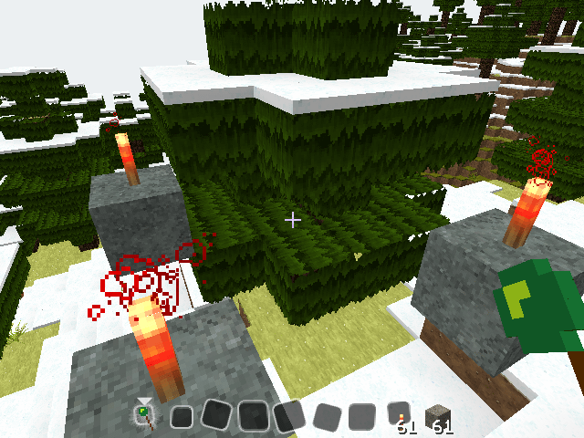
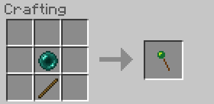



立方体の頂点となる位置にブロックを遠隔で設置します。
（BuildCraft のマーカーを設定する際に便利）

導入方法
--------

### 前提 MOD

- Minecraft Forge

### **ダウンロード**

[こちらからダウンロード][download]
*対応バージョン : Minecraft 1.4.7*

[ソースコード][GitHub]

### インストール

ダウンロードした zip ファイルを .minecraft/mods フォルダに直接入れてください。（クライアント・サーバー共に共通）

使い方/機能
-----------

設置場所に向かって、アイテムの Marker Installer を持って右クリックしてください。
開かれた GUI で、前、右、上（マイナスを指定することでそれぞれ後ろ、左、下も可）の辺の長さを指定して、Install ボタンを押してください。それぞれの位置にスロットに入れたアイテムを設置します。
GUI の数値は Save ボタンを押すことで記憶しておくこともできます。

### レシピ

##### Marker Installer : 木の棒 + エンダーパール

[download]: release/MarkerInstaller.1.0.0.Universal.forMC1.4.7.zip
[GitHub]: https://github.com/AtoCrafter/MarkerInstaller
