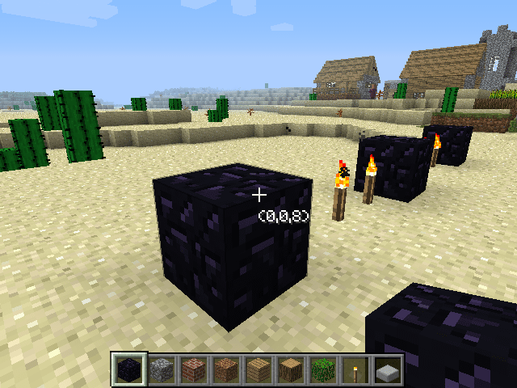



間違えやすいブロックのカウントを楽にします。

導入方法
--------

### 前提 MOD

- Minecraft Forge

### **ダウンロード**

[こちらからダウンロード][download]
*対応バージョン : Minecraft 1.4.7*

[ソースコード][GitHub]

### インストール

ダウンロードした zip ファイルを .minecraft/mods フォルダに直接入れてください。（クライアント・サーバー共に共通）

使い方/機能
-----------

基準となるブロックに向かってCキー（オプションで変更可）を押してください。
もう一度Cキーを押すまで画面中央に基準ブロックからの距離を表示します。

[download]: release/QuickMeasure.1.1.0.Universal.forMC1.4.7.zip
[GitHub]: https://github.com/AtoCrafter/QuickMeasure
