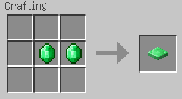



特徴
----

- 何もしなくても腹は減る
- 肥満度と飢餓度の概念を追加します
- 満腹度の機能が常時ハードモードと同じになります
    - ピースフルでも腹がへる
    - ハード以外も餓死する
- 満腹度の減少速度増大！　食料の安定供給が序盤の課題に！

導入方法
--------

### 前提 MOD

- Minecraft Forge

### **ダウンロード**

[通常版ダウンロード][release_download] (通常はこちら)

[開発版ダウンロード][dev_download]

[ソースコード][GitHub]

### インストール

ダウンロードしたファイルを .minecraft/mods フォルダに直接入れてください。（クライアント・サーバー共に共通）

使い方
------

何もしなくても満腹度が減少するようになります。また、各種行動による満腹度減少の速度が非常に大きくなっています。
このため、序盤の食料調達がよりいっそう重要になります（初期スポーンの近くに動物がいないとかなり厳しい）。

ピースフルでも満腹度減少が起き、ハード以外も空腹で餓死するようになります。ただしピースフルのみ HP 回復により餓死はしません。

### 肥満度について

この MOD では肥満度の概念を追加します。

- 脂肪がつくほど、飢餓で死ににくくなる
- 脂肪がつきすぎるとバットステータス
    - 燃費が悪い
    - 走れない
    - ジャンプできない
- 日頃の生活が運動中心だと脂肪がつきにくい
- 食事の際、満腹度、隠し満腹度の超過分が脂肪となる

### 飢餓度について

この MOD では飢餓度の概念を追加します。

- 飢餓度が大きいほど吸収効率がよく、食事が脂肪になりやすい
- 飢えている時間が長いと飢餓度が大きくなる

### 体重計について

肥満度を計測する体重計ブロックを追加します。

このブロックにプレイヤーが乗ると、肥満度 / 10 (切り捨て) の強さのレッドストーン信号を出力します。
体重計を使って健康管理！

### プレイヤーへのみなさんへ

- 健康な生活を送りましょう
- 毎日食事はきちんと摂ってね
- 食べ過ぎに注意
- 普段から運動していると、脂肪がつきにくいです
- 飢えが続くと脂肪を蓄えやすい体質になります
- カロリーの低いものから順に食べると太りにくくなります
- 無理なダイエットはリバウンドのもと
- 飢えはじっと動かないでしのぎましょう

### レシピ

#### 体重計

### コンフィグ

- FoodExhaustionSpeed : 満腹度減少速度の（バニラに対しての）倍率
- HaraheringSpeed : 時間経過による満腹度減少速度
- AlwaysHardmode : 満腹度の振る舞いを常時ハードモードと同じにするかどうか

サポート
--------

バグ、要望がありましたら[マインクラフト　非公式日本ユーザーフォーラム][forum]までご連絡ください。

### 変更履歴

[こちらから](https://github.com/AtoCrafter/ThreeMeals/blob/master/ChangeLog.txt)

[release_download]: https://copy.com/q6VSWUcKmVcZ
[dev_download]: https://copy.com/NO8j7JuuYA93
[forum]: http://forum.minecraftuser.jp/viewtopic.php?f=13&t=4123
[GitHub]: https://github.com/AtoCrafter/ThreeMeals
