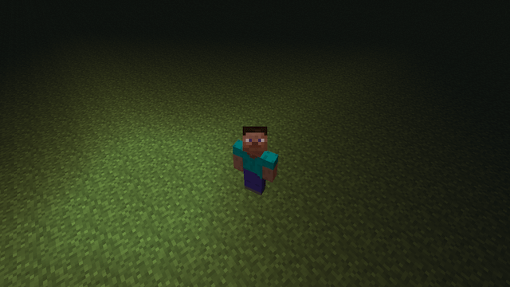
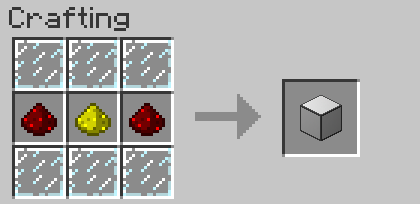
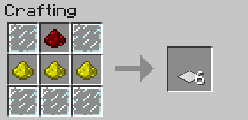
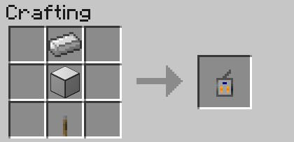
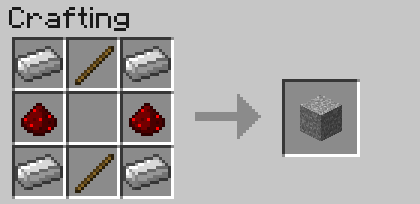
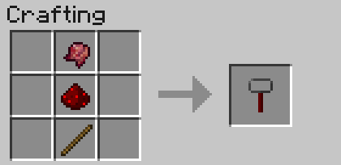



特徴
----

* 修飾に便利な光源ブロックを追加
* ON/OFF の切り替え
* 赤石入力が不要
* 透明化
* Red Power2 のような見た目
* 薄い板状

導入方法
--------

### 前提 MOD

* Minecraft Forge

### **ダウンロード**

[ベータ版ダウンロード][betadownload]
*対応バージョン : Minecraft 1.4.7*

[ソースコード][GitHub]

### インストール

ダウンロードした zip ファイルを .minecraft/mods フォルダに直接入れてください。（クライアント・サーバー共に共通）

使い方
------

ブロック上の光源は設置することができます。また、板状の光源は貼り付けることができます。
光源の on/off を切り替えたい場合は光源を右クリックしてください。

コントローラはスニークボタン（通常は SHIFT キー）+ 右クリックでモードを切り替えられます。右クリックすると各モードの機能が使用できます。
コントローラはボックスに入れて設置することができます。設置方法はコントローラを持って設置したボックスを右クリックです。

光源を透明にするには透明化アイテムを持って光源を右クリックしてください。透明になった光源は透明化キットかコントローラを持っている時以外は見えません。

### レシピ

#### Wireless Light Box : 板ガラス(6) + グロウストーンダスト + レッドストーンダスト(2)

#### Wireless Light Plate (6) : 板ガラス(5) + グロウストーンダスト(3) + レッドストーンダスト

#### Wireless Light Controller : 鉄インゴット + Wireless Light Box + レバー

#### Wireless Light Controller Box : 鉄インゴット(4) + レッドストーンダスト(2) + 木の棒(2)

#### Wireless Light Transparentizer : 発酵した蜘蛛の目 + レッドストーンダスト + 木の棒

[download]: release/
[betadownload]: release/WirelessLight.beta.Universal.forMC1.4.7.zip
[GitHub]: https://github.com/AtoCrafter/WirelessLight
